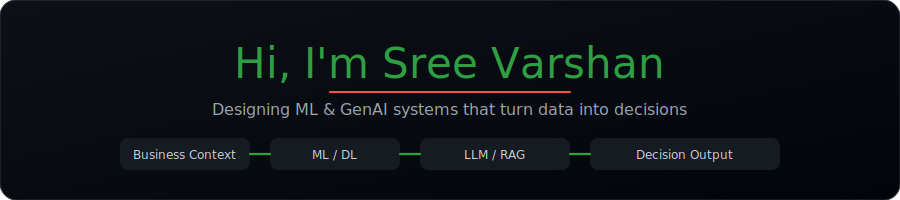
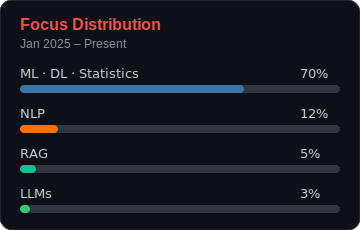
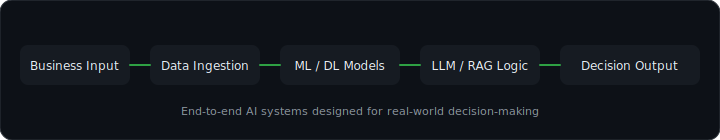

  

  

---
I design machine learning and generative AI solutions that translate business problems into decision-ready outcomes. My work starts with understanding business context and decision requirements, then building end-to-end ML and deep learning workflows that move from data ingestion to prediction, reasoning, and insight delivery.

I focus on system design over isolated models, integrating NLP, retrieval-augmented generation, and LLM-based reasoning into cohesive pipelines that produce reliable and explainable outcomes. My experience includes predictive modeling, text-based NLP pipelines, RAG engineering, and LLM-driven applications built for scalability and clarity.

Currently, I’m expanding my expertise in agent-based AI and MLOps to design ML and LLM systems that operate effectively in real-world environments and deliver measurable business impact. I build AI systems to be deployed, trusted, and used—not just demonstrated.

----------------

----------------

<table align="center">
  <tr>
    <td align="center" valign="top">
      
    </td>
    <td width="25"></td>
    <td align="center" valign="top">
      
    </td>
  </tr>
</table>

  

